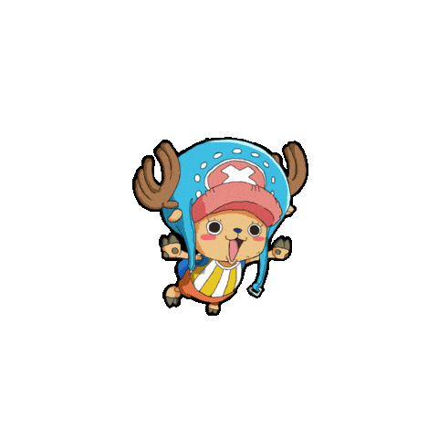

<h1 align="center">Hi 👋 Haditya</h1>
<h3 align="center">A student from Indonesia — Telkom University</h3>

<!-- GIF CHIBI -->

  

<!-- Profile Views -->

  

<!-- Trophy -->

  

---

- 🔭 I’m currently working on **IoT Projects**  
- 👯 I’m looking to collaborate with **students and developers**  
- 🌱 I’m currently learning **C++, Python, and Embedded Systems**  
- ⚡ Fun fact: *I love exploring IoT devices and Linux tinkering*  

---

<h3 align="left">🌐 Connect with me:</h3>

  

---

<h3 align="left">🛠️ Languages and Tools:</h3>

 
   
   
   
   
   
   
   

---

<h3 align="left">📊 GitHub Stats:</h3>

  

&nbsp;

<picture>
  <source media="(prefers-color-scheme: dark)" srcset="https://raw.githubusercontent.com/haditya06/haditya06/output/pacman-contribution-graph-dark.svg">
  <source media="(prefers-color-scheme: light)" srcset="https://raw.githubusercontent.com/haditya06/haditya06/output/pacman-contribution-graph.svg">
  
</picture>

###
